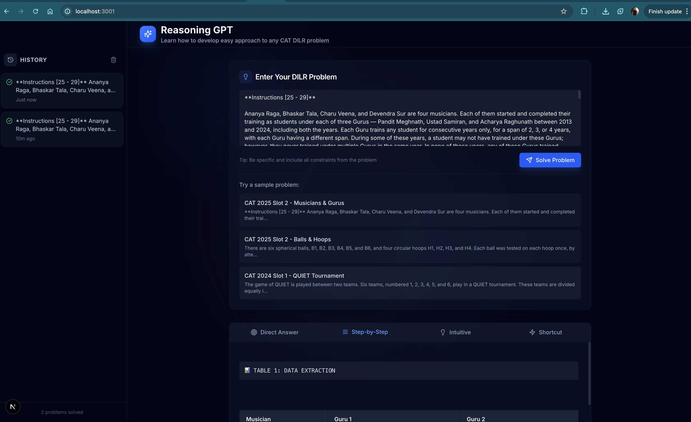

# Reasoning Explainer MVP (Circular Tracks first)

CAT-style Reasoning Explainer AI that takes questions and returns 4 explanation styles:
1. Direct answer
2. Step-by-step solution
3. Simplest intuitive approach
4. Shortcut/exam trick

## Quick Start

### 1. Install Dependencies
```bash
python3 -m pip install -r requirements.txt
```

### 2. Build Vector Store (RAG Pipeline)
```bash
# Set your OpenAI API key for embeddings
export EMBED_API_URL="https://api.openai.com/v1/embeddings"
export EMBED_API_KEY="sk-..."

# Build vector store from seed data
python3 scripts/build_vector_store.py
```

### 3. Test RAG Pipeline
```bash
python3 test_rag.py
```

### 4. Start Backend API
```bash
# Set API keys
export LLM_API_URL="https://api.openai.com/v1/chat/completions"  # or Groq/DeepSeek
export LLM_API_KEY="sk-..."
export LLM_MODEL="gpt-4o-mini"  # or "groq-llama-3.1-70b", etc.
export EMBED_API_URL="https://api.openai.com/v1/embeddings"
export EMBED_API_KEY="sk-..."

# Start server
uvicorn backend.app:app --reload
```

### 5. Test API
```bash
# Health check
curl http://localhost:8000/health

# Solve a problem
curl -X POST http://localhost:8000/solve \
  -H "Content-Type: application/json" \
  -d '{"question": "Two runners A and B start from the same point on a circular track of length 400 m, running in the same direction. A runs at 6 m/s and B at 4 m/s. After how much time will A meet B again?", "top_k": 4}'
```

## Data Pipeline (Optional - for adding more problems)

### Extract from YouTube Videos
```bash
# 1. Download video and extract frames
python3 scripts/ingest_youtube.py --url <YT_URL> --every-seconds 2 --out data/raw

# 2. Extract problems from frames (optimized - uses transcript + sparse frames)
python3 scripts/vision_extract_optimized.py \
  --frames-dir data/raw/frames/<video_id> \
  --transcript-json data/raw/meta/<video_id>.json \
  --api-url https://api.openai.com/v1/chat/completions \
  --api-key $OPENAI_API_KEY \
  --frame-interval 60 \
  --out data/drafts

# 3. Review extractions
python3 scripts/review_extractions.py
```

## Environment Variables

### Required for RAG Pipeline
- `EMBED_API_URL`: Embedding API endpoint (default: OpenAI)
- `EMBED_API_KEY`: Embedding API key
- `EMBED_MODEL`: Model name (default: "text-embedding-3-small" or "text-embedding-3-large")

### Required for Backend API
- `LLM_API_URL`: Chat completion endpoint (Groq/DeepSeek/OpenAI-compatible)
- `LLM_API_KEY`: LLM API key
- `LLM_MODEL`: Model name (default: "gpt-4o-mini")

## Project Structure

```
├── backend/
│   └── app.py              # FastAPI server with /solve endpoint
├── retrieval/
│   ├── embed.py            # Embedding functions
│   ├── store.py             # FAISS vector store
│   └── prompt.py            # Prompt templates
├── scripts/
│   ├── build_vector_store.py  # Build vector store from seed data
│   ├── ingest_youtube.py      # Download videos and extract frames
│   ├── vision_extract_optimized.py  # Extract problems (cost-optimized)
│   └── review_extractions.py  # Review extracted problems
├── data/
│   ├── seed_circular_tracks.jsonl  # Seed dataset (30 problems)
│   └── vector_store.pkl            # Built vector store (generated)
└── test_rag.py             # Test RAG pipeline
```

## Screenshots


*Main application interface showing problem input and solution display*


*Detailed step-by-step solution with progressive tables*


*Multiple solution approaches: Direct, Step-by-Step, Intuitive, and Shortcut*

> 📸 **Note**: Add your screenshots to the `docs/screenshots/` folder. See [docs/screenshots/README.md](docs/screenshots/README.md) for naming conventions.

## Current Status

✅ **Completed:**
- 30+ circular tracks and DILR problems in seed dataset
- RAG pipeline (embedding + retrieval + prompt)
- FastAPI backend with `/solve` endpoint
- Next.js frontend with modern UI
- Cost-optimized extraction from YouTube videos
- Multiple solution approaches (Direct, Step-by-Step, Intuitive, Shortcut)

🚧 **Next Steps:**
- Add more topics (LR, DI, other Quant topics)
- Expand dataset to 100-300 problems
- User authentication and analytics
- Rate limiting and cost controls

